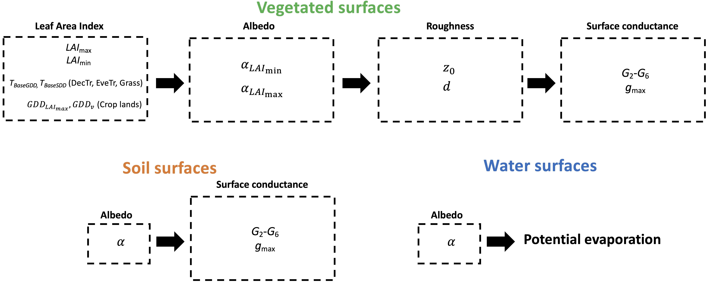

 .. _CalcParam:
 
Calculating your own parameters
--------------------------------
In these tutorials you can calculate various SUEWS parameters before running the model for the specific site and vegetation type. The parameters discussed here are: 
 
 - LAI 
 - albedo
 - surface roughness length and displacement height
 - surface conductances. 

The Figures below shows the order in which parameters should be derived:

These tutorials are based on the calcuations undertaken in Omidvar et al. (2020).

.. _fig_params:

In this example we use meteorological observations from AmeriFlux (https://ameriflux.lbl.gov/) network. The data required are air temperature, incoming shortwave radiation, upwelling shortwave radiation, station pressure, relative humidity, wind speed, precipitation, net all-wave radiation, sensible heat flux and latent heat flux, ideally storage heat flux (os soil heat flux if a simple surface), and the momentum flux. Wind direction is also very helpful.

**Reference**

- Omidvar H, T Sun, S Grimmond, D Bilesbach, A Black, J Chen, Z Duan, Z Gao, H Iwata, JP McFadden. Surface [Urban] Energy and Water Balance Scheme in non-urban areas: developments, parameters and performance, (in review)

Steps to using these notebooks:

1-  Download the following files and codes:

 -  `Data <https://github.com/hamidrezaomidvar/SUEWS_parameters_docs/tree/master/docs/source/steps/data>`_ : data that are necessary to calculate parameters (put them in the same directory as notebooks)
 - Utility functions: these are the utility functions that are called in notebooks. Put them in the same directory as notebooks. 
 
   - `albedo and LAI utility <https://github.com/hamidrezaomidvar/SUEWS_parameters_docs/blob/master/docs/source/steps/alb_LAI_util.py>`_
   
   - `Conductance utility <https://github.com/hamidrezaomidvar/SUEWS_parameters_docs/blob/master/docs/source/steps/gs_util.py>`_
   
   - `Roughness utility <https://github.com/hamidrezaomidvar/SUEWS_parameters_docs/blob/master/docs/source/steps/z0_util.py>`_
 
 - CSV files containing site information and parameters. Put them in the same directory as the notebook:
  
   - `site information <https://github.com/hamidrezaomidvar/SUEWS_parameters_docs/blob/master/docs/source/steps/site_info.csv>`_
   - `site parameters <https://github.com/hamidrezaomidvar/SUEWS_parameters_docs/blob/master/docs/source/steps/all_attrs.csv>`_ . You can then change these parameters if you like to tune the sites.
   
 - `Folder <https://github.com/hamidrezaomidvar/SUEWS_parameters_docs/tree/master/docs/source/steps/runs>`_ contains SUEWS files which are used by SuPy
 
 - `Fig <https://github.com/hamidrezaomidvar/SUEWS_parameters_docs/tree/master/docs/source/steps/figs>`_ folder to write the figure into (it can be empty initially). Put them in the same directory as the notebook.
 
 - `outputs <https://github.com/hamidrezaomidvar/SUEWS_parameters_docs/tree/master/docs/source/steps/outputs>`_ folder to write down pickle files. The structure of the file should be as it is in the link, but the folders (LAI, albedo etc.) can be empty initially. Put them in the same directory as notebook.
 
 **Note**: after downloading the above files an folders, the structure of the directory where you are running the notebooks should be as same as `here <https://github.com/hamidrezaomidvar/SUEWS_parameters_docs/tree/master/docs/source/steps>`_.
   
2- Then you can run each notebook in the same order as below. `Here <https://umep-workshop.readthedocs.io/en/latest/Jupyter/JN1.html>`_ are the instructions how to install and run notebooks.

Leaf Area Index
===============

- `LAI <https://suews-parameters-docs.readthedocs.io/en/latest/steps/LAI.html>`_

Albedo
======
- `Albedo <https://suews-parameters-docs.readthedocs.io/en/latest/steps/albedo.html>`_

Roughmess Parameters
=====================

- `Roughness related  <https://suews-parameters-docs.readthedocs.io/en/latest/steps/roughness.html>`_

-  `SuPy- roughness <https://suews-parameters-docs.readthedocs.io/en/latest/steps/roughness-SuPy.html>`_ 

Surface Conductance Parameters
==============================

-  `Surface conductance <https://suews-parameters-docs.readthedocs.io/en/latest/steps/conductance.html>`_
